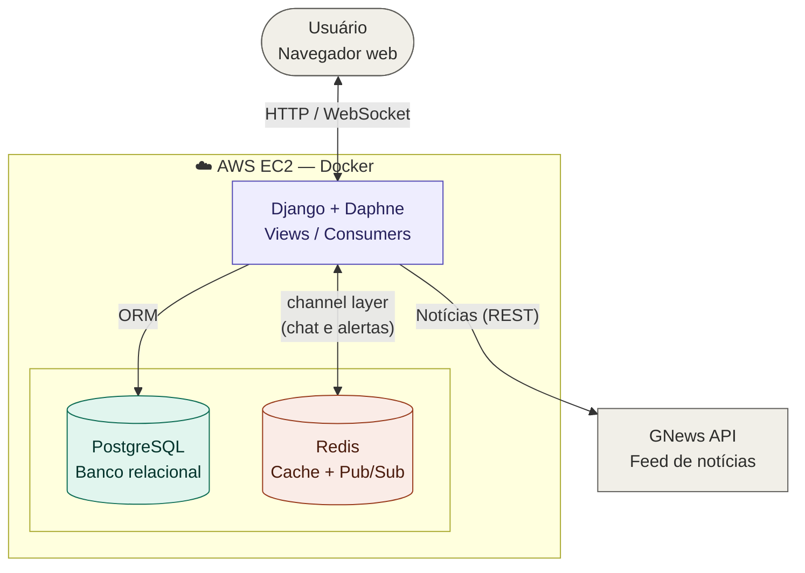

# Gameboxd

O **Gameboxd** é uma aplicação web inspirada no conceito do Letterboxd, mas totalmente voltada para o universo dos jogos eletrônicos. Desenvolvido como projeto para a disciplina de Desenvolvimento Web 2, o sistema funciona como uma rede social e lobby onde os usuários podem catalogar jogos, deixar avaliações detalhadas com notas, gerenciar grupos de jogatina (recrutamento) com chat integrado em tempo real, interagir em um microfórum comunitário (o "Chat...os") e evoluir seus perfis com base no seu engajamento.

---

## Principais Funcionalidades

- **Catálogo de Jogos:** Cadastro de títulos com filtro por gênero e plataforma, busca por nome e carregamento progressivo (infinite scroll via AJAX).
- **Sistema de Avaliações (Reviews):** Usuários podem deixar notas e comentários sobre os jogos. O sistema calcula a **nota média de forma automatizada** diretamente no banco de dados (via sobrescrita dos métodos `save()` e `delete()` do model), com **invalidação de cache automática** a cada nova avaliação.
- **Grupos de Jogatina (Lobbies):** Criação de grupos com foco em jogos específicos, definição de estilo (Casual, Competitivo, Campanha, Iniciantes) e controle de vagas disponíveis.
- **Sistema de Solicitações e Notificações:** Usuários podem solicitar entrada em grupos. O líder recebe notificações em tempo real (via WebSocket) e em um painel exclusivo onde pode **Aceitar** ou **Recusar** o pedido, com decremento automático de vagas e exibição do histórico de solicitações.
- **Sala de Grupo (Chat Privado em Tempo Real):** Líderes e membros aprovados ganham acesso a uma sala exclusiva com chat via **WebSocket** (Django Channels), mostrando os membros da equipe no cabeçalho e persistindo o histórico de mensagens no banco.
- **Mural "Chat...os":** Um microfórum social integrado onde os usuários fazem postagens de até 280 caracteres e respondem às publicações de outros. Usa o padrão **PRG (Post-Redirect-Get)** para evitar duplicação de posts e notifica os usuários online sobre novos posts em tempo real via WebSocket.
- **Perfis Customizáveis:** Foto de perfil, biografia e **cálculo automático de nível de influência** (de *Novato* até *Lenda do Lobby*) baseado no volume de reviews publicadas.
- **Notícias do Mundo Gamer:** Feed de notícias integrado via API externa (GNews), com cache de 20 minutos para evitar requisições desnecessárias.
- **Sistema de Ranks de Influência:** Novato, Explorador, Crítico Veterano e Lenda do Lobby — ranks calculados automaticamente pelo engajamento do usuário.

---

## Tecnologias Utilizadas

| Camada | Tecnologia |
|---|---|
| Backend | Python 3 + Django 6 (MVT Architecture) |
| Tempo Real | Django Channels + Daphne (ASGI) |
| Banco de Dados | PostgreSQL |
| Cache / Pub-Sub | Redis (django-redis + channels_redis) |
| Frontend | HTML5, CSS3, JavaScript, Bootstrap 5 + Bootstrap Icons |
| Containerização | Docker + Docker Compose |
| Arquivos Estáticos | WhiteNoise |
| Deploy | AWS EC2 |
| CI/CD | GitHub Actions |
| Notícias | API GNews |
| Controle de Versão | Git + GitHub Desktop |

---

## Como Configurar e Executar o Projeto Localmente

Siga o passo a passo abaixo para rodar o projeto na sua máquina. Este guia utiliza **Docker**, que já sobe o Django, o PostgreSQL e o Redis com um único comando.

### Pré-requisitos

- [Docker Desktop](https://www.docker.com/products/docker-desktop/) instalado e em execução
- [Git](https://git-scm.com/) instalado

---

### Passo 1: Clonar o Repositório

```bash
git clone https://github.com/David-DEV2005/Gameboxd-Projeto-de-Desenvolvimento-Web-2.git
cd Gameboxd-Projeto-de-Desenvolvimento-Web-2
```

### Passo 2: Criar o arquivo `.env`

Crie um arquivo `.env` na raiz do projeto com base no `.env.example`:

```env
SECRET_KEY=uma-chave-secreta-qualquer
DEBUG=True
ALLOWED_HOSTS=localhost,127.0.0.1

DB_NAME=gameboxd
DB_USER=postgres
DB_PASSWORD=suasenha
DB_HOST=db
DB_PORT=5432

REDIS_HOST=redis

EMAIL_HOST_USER=
EMAIL_HOST_PASSWORD=
API_KEY=sua-chave-gnews
```

### Passo 3: Subir os containers

```bash
docker compose up --build
```

O Docker irá baixar as imagens necessárias, instalar as dependências e subir os três serviços (Django, PostgreSQL e Redis) juntos.

### Passo 4: Executar as Migrações

Em outro terminal, com os containers rodando:

```bash
docker compose exec web python manage.py migrate
```

### Passo 5: Criar um Superusuário

```bash
docker compose exec web python manage.py createsuperuser
```

### Passo 6: (Opcional) Popular o catálogo com jogos da Steam

Coloque o arquivo `games.json` em `lobby/management/commands/data/` e rode:

```bash
docker compose exec web python manage.py seed_jogos_steam
```

### Passo 7: Acessar o projeto

Abra o navegador em:

```
http://localhost:8000
```

---

## Arquitetura do Projeto

O projeto segue o padrão **MVT (Model-View-Template)** do Django, com uma camada extra para tempo real via **WebSocket + Django Channels**, que se comunica com o restante do sistema através de um **channel layer Pub/Sub no Redis**:



> Roxo = camada de aplicação · Verde-água = banco de dados · Coral = cache/Pub-Sub · Cinza = elementos externos ao ambiente

- **Model** (`models.py`): define as entidades e regras de negócio (cálculo de nota média, ranks, etc.)
- **View** (`views.py`): lógica de processamento das requisições HTTP
- **Template** (`.html`): camada de apresentação
- **Consumer** (`consumers.py`): equivalente à View, mas para conexões WebSocket
- **Routing** (`routing.py`): equivalente ao `urls.py`, mas para WebSocket
- **Redis** atua em dois papéis: como **cache** (reviews, notícias) e como **channel layer Pub/Sub**, propagando mensagens de chat e alertas de notificação entre todos os clientes conectados via WebSocket.

---

## Estrutura de Pastas Principal

```
Gameboxd-Projeto-de-Desenvolvimento-Web-2/
│
├── core/                        # Configurações do projeto Django
│   ├── settings.py
│   ├── urls.py
│   └── asgi.py
│
├── lobby/                       # App principal
│   ├── migrations/              # Histórico de migrações do banco
│   ├── management/
│   │   └── commands/
│   │       └── seed_jogos_steam.py   # Comando para popular o catálogo
│   ├── templates/lobby/         # Templates HTML
│   ├── admin.py
│   ├── consumers.py             # Lógica WebSocket (chat + notificações)
│   ├── context_processors.py    # Injeção automática de variáveis globais
│   ├── models.py                # Entidades do sistema
│   ├── routing.py               # Rotas WebSocket
│   ├── views.py                 # Lógica de cada página
│   ├── forms.py                 # Formulários (registro, perfil)
│   └── urls.py                  # Rotas HTTP
│
├── media/                       # Arquivos de upload dos usuários
├── staticfiles/                 # Arquivos estáticos coletados (gerado automaticamente)
├── docker-compose.yml           # Orquestração dos containers
├── Dockerfile                   # Imagem Docker do Django
├── .env.example                 # Exemplo de variáveis de ambiente
├── manage.py
└── requirements.txt
```

---

## Deploy em Produção (AWS EC2)

O projeto está implantado em uma instância **AWS EC2 (Ubuntu 26.04)** com Docker. O ambiente de produção usa:

- `DEBUG=False`
- PostgreSQL dentro do container Docker
- Redis dentro do container Docker
- WhiteNoise para servir arquivos estáticos
- IP elástico fixo para acesso estável

Para atualizar o servidor em produção após um novo commit:

```bash
ssh -i "chave.pem" ubuntu@IP_DO_SERVIDOR
cd ~/Gameboxd-Projeto-de-Desenvolvimento-Web-2
git pull
docker compose up -d --build web
```

---

## CI/CD

O projeto utiliza **GitHub Actions** para integração e entrega contínua. A cada push na branch `main`, o pipeline executa os testes e faz o deploy automático na instância EC2.